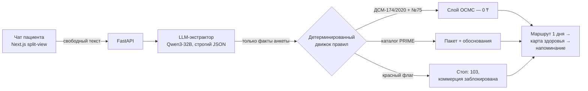

# Check-up Intelligence Constructor

Интеллектуальный конструктор чекапа для PRIME Green Clinic — трек 033, MedHub HAQATON 2026.

Пациент пишет простыми словами в чат. Живая анкета заполняется сама. Детерминированный движок по приказу ДСМ-174/2020 собирает персональный маршрут обследования: что положено бесплатно по ОСМС, чем усилить по PRIME, как проходит один день в клинике и когда возвращаться снова.

**Это не медицинская диагностика.** Система не ставит диагнозы и не назначает лечение — она маршрутизирует к скринингам и чекап-пакетам. Красные флаги останавливают подбор и направляют к врачу (103).

## Как это выглядит

Один экран, две половины:

- **Слева — чат.** Пациент пишет свободным текстом: «42 года, мужчина, постоянно уставший, после еды тяжесть, у отца диабет».
- **Справа — живая анкета.** Плашки «Возраст / Пол / Симптомы / Анамнез / Красные флаги» заполняются в реальном времени, по мере того как система извлекает факты.

Экран результата — четыре блока:

1. **ОСМС, 0 ₸** — скрининги, положенные по приказу ДСМ-174/2020 (ред. № 75/2026) для этого возраста и пола.
2. **PRIME-усиление** — подходящий пакет с ценой и объяснением, зачем каждый анализ.
3. **Маршрут одного дня** — подготовка → визит 8:00–16:00 → результаты на следующий день → заключение куратора через 2–3 дня.
4. **Записаться** — заявка в контакт-центр клиники.

Дальше: карта здоровья («мой план после чекапа») и напоминание о повторном скрининге.

## Архитектура



**Принцип безопасности: ИИ ничего не решает.** Модель (открытая Qwen3-32B) делает ровно две вещи: извлекает факты из текста в строгий JSON анкеты и красиво объясняет готовый результат. Все медицинские пороги — возраст, пол, периодичность скринингов, красные флаги — вычисляет детерминированный Python-движок по `rules.json`, собранному из приказа ДСМ-174/2020 с поправками № 71/2025, № 109/2025 и № 75/2026. Инвариант «красный флаг = ноль коммерческого контента» зашит в схему данных: такой ответ физически не сериализуется.

Устойчивость демо: если ИИ недоступен, анкета работает вручную; если пропала сеть, три золотых кейса рендерятся из кэша мгновенно.

## Стек

- **Фронтенд:** Next.js 14 (App Router), Tailwind CSS, shadcn/ui, Framer Motion, Zustand, React Query
- **Бэкенд:** FastAPI, Pydantic v2 (strict), детерминированный движок правил (Python)
- **ИИ:** Qwen3-32B через OpenRouter (бесплатный tier), строгий JSON-контракт
- **Инфраструктура:** Docker Compose, MIT License — стек полностью open source

## Запуск

```bash
cp .env.example .env   # добавить OPENROUTER_API_KEY
docker compose up --build
# фронтенд: http://localhost:3000   бэкенд: http://localhost:8000/docs
```

Без ключа система тоже работает: анкета вручную + золотые демо-кейсы.

## Демо-кейсы

| Кейс | Ввод | Ожидаемый результат |
|---|---|---|
| GC-1 | Мужчина 42, усталость, тяжесть после еды, отец — диабет | Скрининг АГ/ИБС/СД по ОСМС (0 ₸) + мужской расширенный 40+ |
| GC-2 | Женщина 35, плановый чекап | Скрининг шейки матки (0 ₸) + женский базовый до 40 |
| GC-3 | Мужчина 55, острая боль за грудиной | Стоп: 103, подбор чекапа заблокирован |

## Структура репозитория

```
backend/    FastAPI, движок правил, тесты
frontend/   Next.js split-view UI
rules.json  ДСМ-174/2020 (+ №75) и каталог PRIME — вся медицинская логика здесь, не в коде
```

Все пациенты в демо — синтетические. Цены — опубликованный прайс; финальную стоимость и состав подтверждает клиника PRIME.

## License

MIT

<p align="right"><sub>Blessed by &lt;O&gt;</sub></p>
